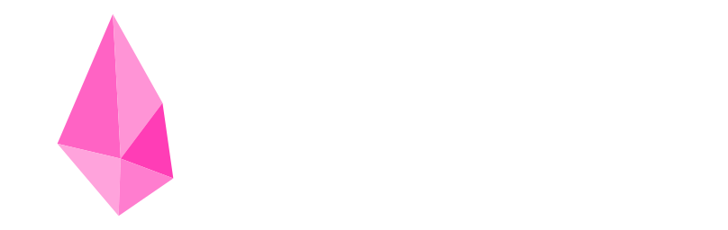

<p align="center">
  
</p>


# Crysta UI
Crysta UI is a lightweight, modern UI framework for Python, built to power stunning and responsive applications within AnvPy. With customizable components, minimal setup, and a clean design system, it enables developers to create fast, scalable, and visually rich interfaces with ease.

## Features
- [x] Modern and Minimal Design
- [x] Highly Customizable
- [x] Contains a set of Widgets and Designs
- [x] Responsive to all kinds of mobile screens
- [x] Simple and Scalable

## Prerequisites
- AnvPy installed on your Android device
- Basic knowledge of Python and JavaScript
- Android device running Android 7.0 or higher

## Installation
1. Install AnvPy from [Google Play Store](https://play.google.com/store/apps/details?id=org.python.adp)
2. Open AnvPy and create a new project
3. Select "Crysta UI Template" from the project templates
4. Start building your UI!

## Quick Start
```python
# Example of creating a simple Crysta UI app
from crysta import Root, Button

app = Root("home")

# Create a stylish button
button = Button(text="Click Me!", onClick=lambda: print("Button clicked!"))

app.add(button)
app.run()
```

## Project Structure
- `index.js` - Core JavaScript implementation of Crysta UI components
- `index.css` - Styling and theming for all UI components
- `temp.html` - Base template for Crysta applications
- `assets/` - Contains images and other static resources
- Font files (`google.ttf`, `manrope.ttf`) - Custom fonts for typography

## Documentation
- Official Documentation: [Crysta UI Docs](https://anvpy.org/crysta.html)
- Examples and Demos: Available in the Samples section of AnvPy
- Tutorials and Guides: Check the [AnvPy Community Forum](https://anvpy.org/forum)

## Contributing
We welcome contributions of all kinds! Whether it's bug fixes, new features, or documentation improvements.
See our [Contributing Guidelines](./CONTRIBUTING.md) for details on how to get started.

## Community
- Join our [Discord Server](https://discord.gg/anvpy)
- Follow us on [Twitter](https://twitter.com/anvpy)
- Visit the [AnvPy Forum](https://anvpy.org/forum)

## About Crysta UI
Crysta is a UI framework built on top of the Web, designed to seamlessly integrate with Python. It enables Python code to run on a separate thread, resulting in improved performance and responsiveness.

Crysta provides a lightweight yet powerful foundation for building modern applications within the AnvPy ecosystem.

## License
Crysta is open for study and modification, but *use is restricted exclusively to the AnvPy environment*.  
See the [LICENSE](./LICENSE) file for full details.

---
Made with ❤️ by the AnvPy Community
